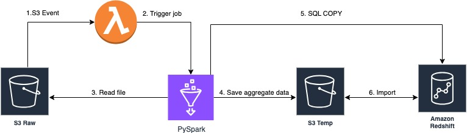

# Answers
1. Как запустить ETL вручную \
    1.1. Click on `Action` in the top menu. \
    1.2. Click on `ETL Pipeline Runner` on the left part of the window.
    1.3. Click on pop-up `Run workflow`, choose branch and click `Run workflow`.
2. Как работает CI/CD 
    Workflow `ETL Pipeline Runner` is configured in `.github/workflows/etl_pipeline.yml`
    2.1. GitHub spin up temporary worker with ubuntu OS. \
    2.2. The code from repo is copied to the worker. \
    2.3. The python 3.13 is installed on worker. \
    2.4. Dependencies installation step (poetry + dependencies). \
    2.5. The script is executed.
3. Как бы вы адаптировали решение под 100+ млн строк: \
    3.1. Какие технологии замените/добавите? \
        Pandas will be changed on polars (I haven't worked with it, only read), PySpark. \
    3.2. Какую архитектуру ETL предложите?
    3.3. Какие метрики мониторинга ETL вы бы внедрили? \
    3.4. Где будут храниться входные и выходные данные? 

## ETL Pipeline General Architecture
 - Source storage - AWS S3
 - Processing - AWS Glue with Spark 
 - Output storage - DWH (Redshift or Snowflake)
 - Orchestration - as I understand, the job has to trigger when the new file is loaded to S3, so for this scenario the best choice is: S3 Event + Lambda to trigger AWS Glue Job.

The ETL Pipeline high level schema:

## Metrics:
1. How long pipeline works.
2. The number of processed rows per second.
3. Data quality:
    3.1. How many invalid rows (percentage)
    